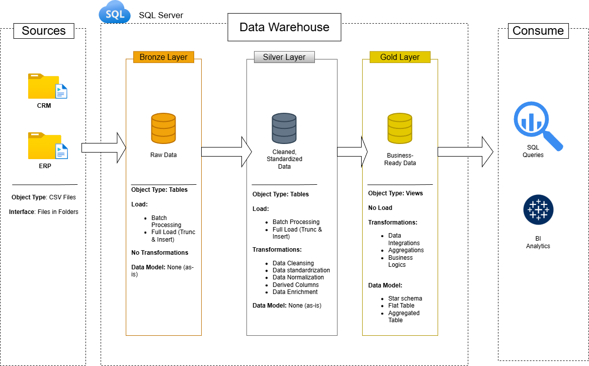

# Data Warehouse Project

Welcome to my **Data Warehouse and Analytics Project**  
This project presents a complete data warehousing solution by implementing an ETL process from scratch to integrate customer and product datasets.

---
## Data Architecture

The data architecture for this project follows Medallion Architecture **Bronze**, **Silver**, and **Gold** layers:

1. **Bronze Layer**: Contains raw data ingested directly from source systems, with CSV files loaded into a SQL Server database without transformation.
2. **Silver Layer**: Focuses on data cleansing, standardization, and normalization to ensure consistency and analytical readiness.
3. **Gold Layer** : Stores business-ready data structured in a star schema to support reporting and advanced analytics.
